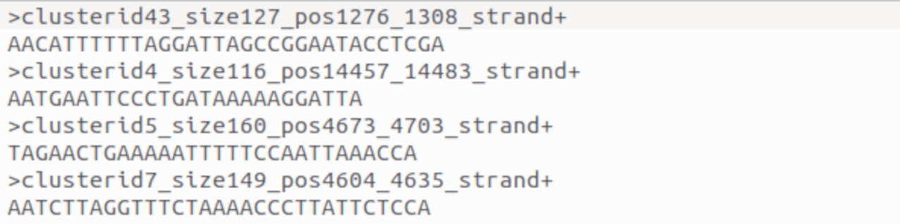
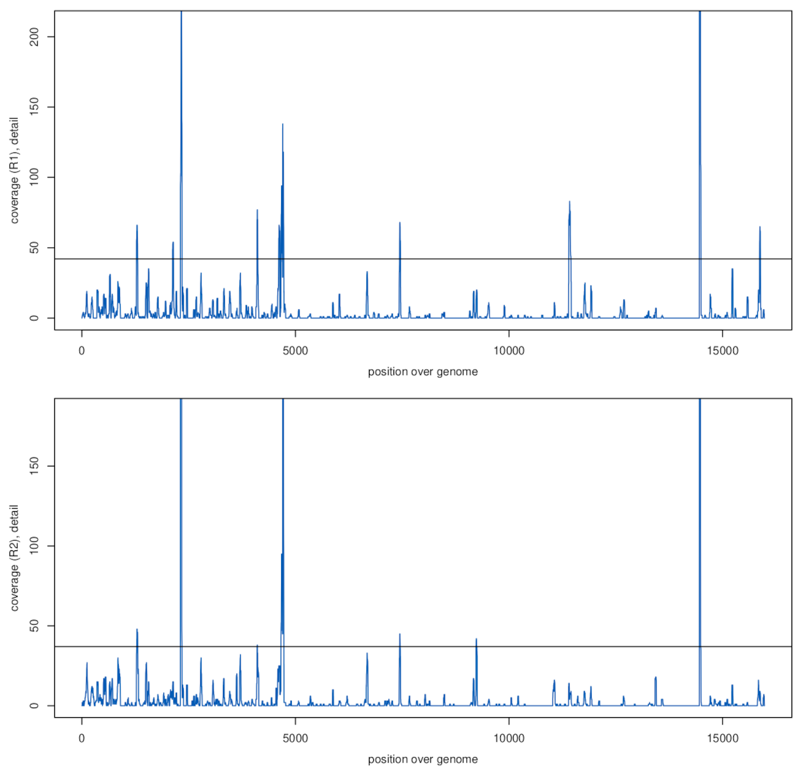
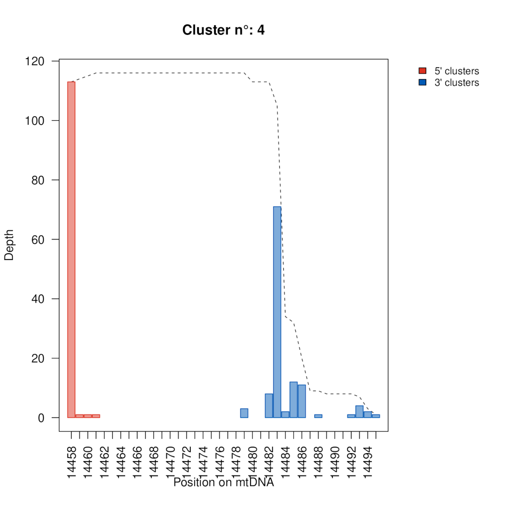
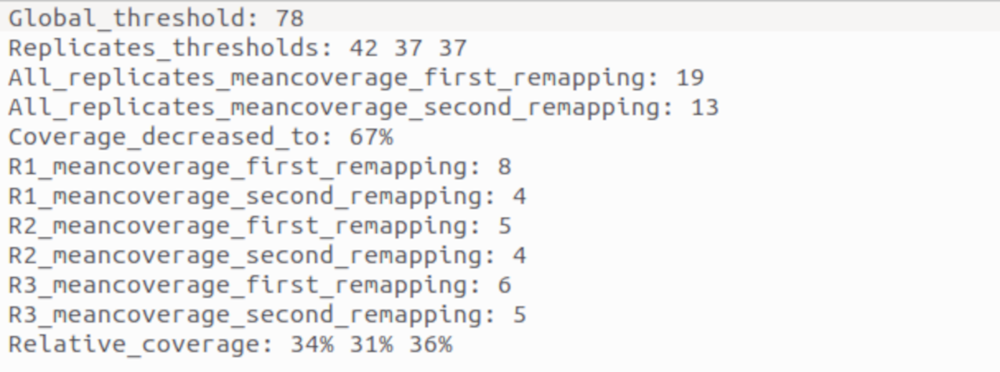
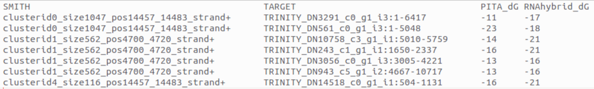
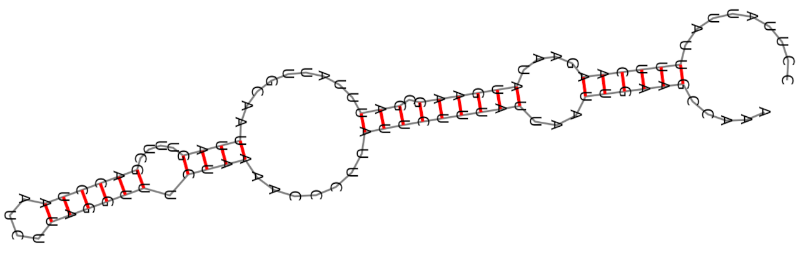

# WORK IN PROGRESS
# Introduction

The following information is about how to **setup and use the SmithHunter pipeline for the identification of candidate smithRNAs and their targets**. The pipeline is described in the accompanying publication (see below).

SmithHunter is written in bash, with scripts in R. It has been developed and tested under Ubuntu 22.04.3 LTS but should run on any linux OS provided the conda environment and PITA can be successfully installed.

Being the first release of the pipeline (v.0), and despite accurate testing, it may contain bugs. In case of problems, please get in touch with us.  

Questions, comments and requests for help can be addressed to Dr. Giovanni Marturano at the University of Siena (giovanni.marturano@unisi.it) and Dr. Diego Carli at the University of Bologna ([diego.carli2](mailto:diego.carli2@unibo.it)[@](mailto:diego.carli2@unibo.it)[unibo.it](mailto:diego.carli2@unibo.it)).

If you use the SmithHunter pipeline you should cite the following publication:

Marturano G, Carli D, Cucini C, Carapelli A, Plazzi F, Frati F, Passamonti M, Nardi F. SmithHunter: a workflow for the identification of candidate smithRNAs and their targets. Submitted to BMC Bioinformatics.

Please also consider citing the original smithRNA publications:

Pozzi A, Plazzi F, Milani L, Ghiselli F, Passamonti M. SmithRNAs: Could Mitochondria "Bend" Nuclear Regulation? Mol Biol Evol. 2017 Aug 1;34(8):1960-1973. doi: 10.1093/molbev/msx140. PMID: 28444389; PMCID: PMC5850712.

Passamonti M, Calderone M, Delpero M, Plazzi F. Clues of in vivo nuclear gene regulation by mitochondrial short non-coding RNAs. Sci Rep. 2020 May 19;10(1):8219. doi: 10.1038/s41598-020-65084-z. PMID: 32427953; PMCID: PMC7237437.

# Installation and setup

## Overview
SmithHunter setup entails cloning the latest distribution from GitHub and running the `installer.sh` executable. Two dependencies are needed and not included in the distribution: conda and PITA. At first execution, installer.sh will search the local system for conda and PITA and, if not available, will offer the opportunity to download/install both.

## Procedure
- Get ready. If you plan to install only SmithHunter (i.e. you already have conda and PITA) only `git` utilities are needed. If you have used software from GitHub in the past, high chance is that these are already installed in the system.
> sudo apt install git

- Get ready. If you plan to install PITA as well, build tools will also be needed. High chance is that these are already installed in the system.
> sudo apt install make    
> sudo apt install g++

- cd in a location of choice in your computer and git-clone the SmithHunter repository using the following command:
> git clone https://github.com/ESZlab/SmithHunter

- cd into the folder and run the installer:
> cd SmithHunter \
> bash -i installer.sh

- Be patient, depending on internet speed, this can take several minutes.
- The installer will look for a conda installation on the local system. If not available it will offer to install miniconda3 from its website (https://docs.anaconda.com/free/miniconda/index.html). Upon a positive answer, and after accepting conda conditions for installation, the installer will install miniconda3 in the user's home directory.
- The installer will create a conda environment that includes all additional dependencies. SmithHunter executables will be called within this environment.
- The installer will look for PITA on the local system. If not available will offer to install PITA from GitHub. Upon a positive answer, will install PITA within the SmithHunter folder. If you use PITA, consider giving credit for it.

- Make the SmithHunter scripts executable:
> chmod +x smithHunterA.sh smithHunterB.sh sharp_smith.R

- Add the SmithHunter folder to your executable pahts. This is not strictly necessary, as long as scripts are called using their path. Nevertheless, adding the SmithHunter folder to your executable pahts will allow the scripts to be called from any folder in the computer, making everything easier. To add it temporarily (until you close the terminal) simply type the following command. Be sure to replace `~/my/SmithHunter/folder` with the actual installation folder on your computer.
> export PATH="$PATH:~/my/SmithHunter/folder"

- To add it permanently, locate a hidden file named `.bashrc` in your home directory. Edit the file by adding the `export PATH="$PATH:~/my/SmithHunter/folder"` command at the end. Restart the system. 

## Testing
SmithHunter includes **a minimal dataset for testing purposes**. It includes unpublished data from *Ceratitis capitata* (PE smallRNA reads, 3 replicates; mitochondrial genome) as well as the transcriptome (reassembled from SRR836188-90 and reannotated) and the nuclear genome of the species (AOHK00000000.2). All these have been heavily subset for efficiency and are not liable to produce biologically meaningful results apart for testing the script and displaying SmithHunter functionalities. The test will complete in 2-3 minutes.

The following commands assume that SmithHunter has been installed, that PITA has been installed concomitantly (it will be in `~/SmithHunter/pita/pita_cpp`) and that the SmithHunter folder has been added (temporarily or permanently) to your executable pahts. If not, the actual location of the scripts, working folder (-W), sequence folder (-F) and PITA (-P) have to be specified using options. See below for a detailed explanation of options. It further assumes that commands are executed from the working directory (for the purpose of the current example, a subfolder called `example` in the SmithHunter installation directory).

- Testing SE functionality:
>     cd example 
>     bash -i smithHunterA.sh -O test \
>     -T SE \
>     -a TGGAATTCTCGGGTGCCAAGG \
>     -S 0.80

>     sharp_smith.R --mode=list 

>     bash -i smithHunterB.sh -O test

Upon a succesfull execution, results will be available in `/example/test_main_outputs`

- Clean up:
>     rm -r {0..11}_* test_main_outputs test_Transcripts.fasta.fai smith.log test_UTR.fasta test_samples.txt

- Testing PE functionality:
>     cd example
>     bash -i smithHunterA.sh -O test \
>     -T PE \
>     -a TGGAATTCTCGGGTGCCAAGG \
>     -A GATCGTCGGACTGTAGAACTCTGAAC \
>     -S 0.80

>     sharp_smith.R --mode=list

>     bash -i smithHunterB.sh -O test

- Upon a succesfull execution, results will be available in `/example/test_main_outputs`

- Clean up:
>     rm -r {0..11}_* test_main_outputs test_Transcripts.fasta.fai smith.log test_UTR.fasta test_samples.txt

# Usage of SmithHunter

- One key information for the script is the **organismID**. It is indicated by the user and can be any string that relates to the species under study (e.g. Ruditapes). This is an unique identifier for input and output data pertaining to a single organism. In short, organismID allows, if multiple analyses are run, to identify all files pertaining to one organism.

- One more key information is the **working directory**. All input (apart from raw sequence reads) and output files from an analysis have to be, and will be written, in the working directory. This is, by default, the directory from which the script is run, but can be modified using the -W option (see below).

- The user may find all **relevant output** in folder `organismID_main_outputs` within the working directory. The script produces a lot of additional information as intermediate files that may be used for debugging purposes. If you plan to get in touch with us for help, please do not delete these additional files.

- The test run above heavily relies on a savy use of defaults to specify the location of the working folder, sequence folder and PITA. Having all elements within the working folder and PITA installed witin the SmithHunter folder allows to simply cd into the working folder and run the analysis. Alternatively, the correct position of all these elements can be specified using options. See the examples below for a detailed explanation of the file structure and use of options. If the SmithHunter folder has not been added to your executable pahts, the main scripts can be also run by invoking their full path (e.g. `~/programs/SmithHunter/smithHunterA.sh` or by cd-ing into the SmithHuter folder and running them as `./smithHunterA.sh`). 

## Step1, module A

The first module, named `smithHunterA.sh`, focuses on the **identification and filtering of presumptive smithRNA** sequences, defined as centroids of clusters with significant transcription levels and a narrow 5’ transcription boundary. It takes as input one or more small RNA libraries (replicates), the sequence of the mitochondrial genome and (optionally) the sequence of the nuclear genome of the species of interest. Main output is a list of presumptive smithRNA sequences, filtered based on parameters defined by the user, as well as graphics depicting: a) read coverage over the mitochondrial genome, global and per replicate; b) cluster position/abundance on the mitochondrial genome and c) 5’ and 3’ end conservation.

### Input file naming:

- for paired end (PE) data, smallRNA sequence file names should end in ‘`_1.fastq.gz`’ and ‘`_2.fastq.gz`’

- for single end (SE) data, the smallRNA sequence file name should end in ‘`_1.fastq.gz`’ (either PE or SE data are required)

- the sequence of the mitochondrial genome, in fasta format, should be named `organismID_mit.fasta` (required, has to be in the working directory)

- the sequence of the nuclear genome, in fasta format, should be named `organismID_nuc.fasta` (optional, if present has to be in the working directory)

### Command line

    bash -i smithHunterA.sh -O organism_ID -W ~/myWorkingDirectory/ [options]

### Options

-W \<working dir path>
It is the main working directory where input and output files are found. Default is the folder from which the script is launched.
  
-F \<fastq dir path>
It is the folder where smallRNA sequence files (.fastq.gz) are. Default is a sub-folder named ‘fastq’ within the working directory.
  
-O \<organism ID>
A string, identifies the species under study and all files pertaining to it. Default is ‘unknown’.

-T \<trimming:PE-SE-NO>
Indicates if smallRNA sequence data are single end (SE) or paired end (PE). NO disables trimming altogether and allows the use of pre-trimmed reads (only forward reads are used). Default is SE.
  
-a \<adapter sequence R1>

-A \<adapter sequence R2>
Adapter sequence for R1 (or single end) and R2 reads. No default. Indication of the adapter sequence is required if running in SE (via option -a). When running in PE, if option is not specified, fastp will run under its defaults (i.e. automatic recognition of adapters).
  
-I \<clustering identity:0-1>
Number [0-1] indicating the identity required for reads to be clustered together. Higher means that only very similar reads will be joined in the same cluster. Default is 0.95.

-S \<stringency:0-1>
Number [0-1] indicating how large a cluster has to be to pass the depth filter. Higher means that only the deepest clusters will pass. Default is 0.5

-M \<min replicates>
Number [1-number of replicates]. minimum number of replicates where a cluster is to be observed to pass the replicates filter. Higher is more stringent. Default is 1.

-s \<shift:mito-genome origin>
Number [1-length of the mitochondrial genome], used to recircularize the mitochondrial genome at a specific position before the analysis. Important: it can be used only for complete and circular genomes. Default is 1, i.e. no recircularization.

-t \<threads:1-40>
Number of parallel processes during alignment. Default is 5.

### Example 1

We are analyzing data from the species *Ruditapes philippinarum* and we will use ‘RUDI’ as organism_ID. We have smallRNA sequencing data (single end) in three replicates and we know the adapter sequence for trimming. We have the mitochondrial genome sequence for the specie but not the nuclear genome sequence. We are aiming at a first exploration of smithRNAs in the species, hence we’ll be using fairly permissive sets. 

Files are organized as follows:

    ~/myWorkingDirectory/RUDI_mito.fna (the mitochondrial genome)
    ~/myWorkingDirectory/rawdata/MicroReplicate1_1.fastq.gz (smallRNA sequencing data)
    ~/myWorkingDirectory/rawdata/MicroReplicate2_1.fastq.gz
    ~/myWorkingDirectory/rawdata/MicroReplicate3_1.fastq.gz
    ~/prog/SmithHunter/ (SmithHunter installation folder)

Command:

    bash -i smithHunterA.sh -O RUDI \
    -W ~/myWorkingDirectory/ \
    -F ~/myWorkingDirectory/rawdata/ \
    -T SE \
    -a TGGAATTCTCGGGTGCCAAGG \
    -I 0.95 \
    -S 0.2 \
    -M 1 \
    -t 16

### Example 2

We are analyzing data from the species *Ruditapes philippinarum* and we will use ‘RUDI’ as organism_ID. We have smallRNA sequencing data (paired end) in three replicates and we want to perform the trimming using fastp automatic adapter recognition (note: with real data, explicit indication of adapter sometimes leads to an improved trimming). We have the mitochondrial genome sequence as well as the nuclear genome sequence for the species. We are aiming at a small set of the best candidates, hence we’ll be using fairly stringent sets.

Files are organized as follows:

    ~/myWorkingDirectory/RUDI_nuc.fna (the nuclear genome)
    ~/myWorkingDirectory/RUDI_mito.fna (the mitochondrial genome)
    ~/myWorkingDirectory/rawdata/MicroReplicate1_1.fastq.gz (smallRNA sequencing data)
    ~/myWorkingDirectory/rawdata/MicroReplicate1_2.fastq.gz
    ~/myWorkingDirectory/rawdata/MicroReplicate2_1.fastq.gz
    ~/myWorkingDirectory/rawdata/MicroReplicate2_2.fastq.gz
    ~/myWorkingDirectory/rawdata/MicroReplicate3_1.fastq.gz
    ~/myWorkingDirectory/rawdata/MicroReplicate3_2.fastq.gz
    ~/prog/SmithHunter/ (SmithHunter installation folder)

Command:

    bash -i smithHunterA.sh -O RUDI \
    -W ~/myWorkingDirectory/ \
    -F ~/myWorkingDirectory/rawdata/ \
    -T PE \
    -I 0.95 \
    -S 0.8 \
    -M 3 \
    -t 16

### Key output
Key output (within `organismID_main_outputs` folder in the working directory):

`presumptive_smithRNAs.fa` - sequence (centroids) of the clusters passing filters (i.e. presumptive smithRNAs from module A). The header reports cluster name, depth, start and end with respect to the mitochondrial genome, strand.

`Plots/COV2.pdf` – smallRNA read coverage over the mitochondrial genome. If a nuclear genome is provided, remapping of all reads will show in red and remapping of uniquely mitochondrial reads (i.e. reads not remapping on the nuclear genome) will show in blue. Detail of low coverage areas appears in a secondary plot. The horizontal line indicates the T1 threshold.

`Plots/COV2.replicates.pdf` – per replica smallRNA read coverage over the mitochondrial genome. Detail of low coverage areas, unique mitochondrial reads. The horizontal line indicates the (per replicate) T2 threshold.

`Plots/COV2.clusters.pdf` - cluster distribution over the mitochondrial genome. Clusters in forward orientation (i.e. aligning to the mitochondrial genome as submitted) are shown in red, clusters in reverse orientation are shown in blue. The horizontal line indicates the (global) T1 threshold. The example below is part of a multi-panel image.

`Plots/Plot.pdf` - distribution of cluster 5’ and 3’ ends, as well as coverage over the mitochondrial genome, to evaluate end conservation.

`Plots/COV2.stats` – threshold and coverage information.

## Step 2 (optional) manual selection of clusters

The user can **manually edit the presumptive smithRNA list** produced by module A, adding or removing presumptive smithRNAs, before running module B. More specifically, we envision that the user may manually select a) smithRNAs with more conserved 5’ and 3’ end (based on output `Plot.html` from module A); b) smithRNAs from specific parts of the genome; c) smithRNAs within a specific size range.

The file to be edited is `/7_organismID_smithRNAs/presumptive_smithRNAs.fa` within the working directory. The corresponding file in the `organismID_main_outputs` folder is for user's review only and does not enter the module B script.

An additional script is distributed with SmithHunter to help perform this task (`sharp_smith.R`). The scoring scheme is still experimental and we do not advise a non supervised use of the script to filter presumptive smithRNAs at this stage. Nevertheless it may be used for a quick filtering of very low scoring smithRNAs or in conjunction with manual revision of end conservation in `Plot.html` (from module A). The script has to be executed from the smithHunter conda environment.

### Command line

    sharp_smith.R --mode [list, score, filter] --path_bedfiles [--t_five_score] [--t_three_score] [--path_smith]

### Options

--mode
- list: lists all smithRNAs, indicating if each passes the end conservation thresholds. Produces a table with cluster number (first column), NA (second column), and an indication if cluster passed end conservation filter (y/n; third column).
- score: lists all smithRNAs and the corresponding end conservation scores. Produces a table with cluster number (first column), score of 5' end conservation (second column), score of 3' end conservation (third column) and NA (fourth column).
- filter: applies the end conservation thresholds supplied to a preexisting smithRNA fasta file (e.g. the output of module A) and retains only those smithRNAs that pass end conservation filters.

--path_bedfiles
Path to clusters bed folder (`/5_organismID_clustering/5.2_organismID_results.clusters.bedfiles/` in the working directory). Default is a folder named `/5_organismID_clustering/5.2_organismID_results.clusters.bedfiles/` within the current directory.

--t_five_score
Number [0-1] indicating the 5’ end conservation threshold to be applied. Higher means that only clusters with a very tight 5’ end will pass. Optional, default is 0.4.

--t_three_score
Number [0-1] indicating the 3’ end conservation threshold to be applied. Higher means that only clusters with a very tight 3’ end will pass. Optional, default is 0.
  
--path_smith
Path to file with smithRNAs from moduleA (`/7_organismID_smithRNAs/presumptive_smithRNAs.fa` in the working directory). Default is `/7_organismID_smithRNAs/presumptive_smithRNAs.fa` within the current directory. Mandatory only in conjunction with `-mode filter`.

### Example 1

We have already run module A and this produced a list of presumptive smithRNAs. We wish to experiment with automatic filtering for end conservation, or to have a first indication (to be corroborated by observation of `Plot.html` from module A) of which smithRNAs appear to have a tighter end. We do not want to actually edit the `presumptive_smithRNAs.fa` file, that will be input for module B, but just see the results. In the current analysis we are using ‘RUDI’ as organism_ID and `~/myWorkingDirectory` as working directory.

Files are organized as follows:

    ~/prog/SmithHunter/ (SmithHunter installation folder)
    ~/myWorkingDirectory/5_RUDI_clustering/5.2_DJA_results.clusters.bedfiles/ (clusters bed folder)

Commands:

    # activate enviroment
    conda activate smithHunter_env 
    # see which smithRNA would pass filters (y/n), output to screen.
    sharp_smith.R \
    --mode=list \
    --path_bedfiles=~/myWorkingDirectory/5_RUDI_clustering/5.2_RUDI_results.clusters.bedfiles/
    # see end conservation scores, output to screen.
    sharp_smith.R \
    --mode=score \
    --path_bedfiles=~/myWorkingDirectory/5_RUDI_clustering/5.2_RUDI_results.clusters.bedfiles/
    # deactivate environment
    conda deactivate

### Example 2

We have already run module A and this produced a list of presumptive smithRNAs. Using `sharp_smith.R` (in `list` or `score` mode) we identified end conservation thresholds that fit our needs. We wish to filter the presumptive smithRNA list from module A according to these filters and use this filtered list for target identification in module B. In the current analysis we are using ‘RUDI’ as organism_ID and `~/myWorkingDirectory` as working directory.

Files are organized as follows:

    ~/prog/SmithHunter/ (SmithHunter installation folder)
    ~/myWorkingDirectory/5_RUDI_clustering/5.2_DJA_results.clusters.bedfiles/ (clusters bed folder)
    ~/myWorkingDirectory/7_RUDI_smithRNAs/presumptive_smithRNAs.fa (presumptive smithRNAs from module A, that will be read by module B)

Commands:

    # activate enviroment
    conda activate smithHunter_env
    # filter presumptive smithRNAs according to thresholds.
    sharp_smith.R \
    --mode=filter \
    --path_bedfiles=~/myWorkingDirectory/5_RUDI_clustering/5.2_RUDI_results.clusters.bedfiles/ \
    --t_five_score=0.7 \
    --t_three_score=0.7 \
    --path_smith=~/myWorkingDirectory/7_RUDI_smithRNAs/presumptive_smithRNAs.fa
    # filtered list will be in presumptive_smithRNAs.fa
    # original smithRNA list will be named presumptive_smithRNAs_old.fa
    # deactivate environment
    conda deactivate

## Step 3, module B.

The second module, named `smithHunterB.sh`, deals with the **identification of possible nuclear targets and pre-miRNA-like precursor structures for presumptive smithRNAs**. It takes as input the list of presumptive smithRNAs identified by the first module and the transcriptome of the species of interest (fasta format), with annotated 5’ and 3’ UTR regions (bed format). Main output is a list of nuclear transcripts putatively targeted by individual smithRNAs, information regarding Gibbs Free Energy (dG) of RNA-RNA hybrids stability of smithRNA/target pairs and putative precursor structures. Instructions are given under the assumption that execution of the second module follows execution of the first module in the same working directory (option -W) and under the same organismID (option -O).
Some files produced during the execution of the first module are needed for the correct execution of the second module. Please do not delete/move/rename files in the working directory in between execution of the first and second module. 

### Input file naming:

- The transcriptome, in fasta format, should be named `organismID_Transcripts.fasta` (required, has to be in the working directory).
- Annotation file, with UTR regions in bed format, should be named `organismID_UTR.bed` (required, has to be in the working directory).

### Command line:

    bash -i smithHunterB.sh -O organism_ID -W ~/myWorkingDirectory/ -P ~/path/to/pita/folder/ [options]

### Options:

-W \<working dir path>
It is the main working directory where input and output file are found. It must be the same working directory used in the first module. Default is the folder from which the script is launched.
  
-P \<pita software path>
Full path to the folder where the PITA executable is. If PITA has been installed ex novo by the SmithHunter installer, the PITA path is `~/mySmithHunterFolder/PITA/pita_cpp/`. Default is `/PITA/pita_cpp/` within the SmithHunter folder, i.e. where PITA is if it has been installed concomitantly with SmithHunter.
  
-O \<organism ID>
A string, identifies the species under study and all files pertaining to it. It must be the same name used in the first module. Default is ‘unknown.’

-X \<start seed position>
Number [1-20] indicating the starting position of the seed region with respect to the smithRNA sequence. Default is 4.
  
-Y \<end seed position>
Number [start seed position-20] indicating the final position of the seed region with respect to the smithRNA sequence. Default is 10.
  
-m \<mismatches allowed in the seed region>
Number [0-2] indicating the number of mismatches allowed within the seed region. Default is 0.

-R \<RNA folding temperature>
Number [int] indicating the pre-miRNA folding temperature (in °C) for RNAhybrid. Default is 25.
 
-1 \<pre-miRNA distance1>
Number [1-100], default is 15.

-2 \<pre-miRNA distance2>
Number [1-100], default is 50.

Together, they indicate the span of the pre-miRNA sequence to be evaluated upstream and downstream of the miRNA for folding. Both options (i.e. distance1-miRNA-distance2 and distance2-miRNA-distance1) are evaluated.

### Example 1

We have already run module A, specifying ‘RUDI’ as organism_ID and `~/myWorkingDirectory/` as working directory. PITA (`pita_prediction.pl`) is in folder `/prog/SmithHunter/pita/pita_cpp/`. We have the transcriptome sequences in fasta format and an annotation of 5’ and 3’ UTRs in bed format. We want to use conservative sets for target identification, we will use defaults. 

Files are organized as follows:

    ~/myWorkingDirectory/RUDI_Transcripts.fasta (the transcriptome)
    ~/myWorkingDirectory/RUDI_UTR.bed (5’ and 3’ UTRs annotation)
    ~/myWorkingDirectory/7_RUDI_smithRNAs/presumptive_smithRNAs.fa  (list of presumptive smithRNAs from module A)
    ~/prog/SmithHunter/ (SmithHunter installation folder)
    ~/prog/SmithHunter/pita/pita_cpp/pita_prediction.pl (pita executable)

Command:

    bash -i smithHunterB.sh -O RUDI \
    -W ~/myWorkingDirectory/ \
    -P ~/prog/SmithHunter/pita/pita_cpp/

### Example 2

We have already run module A, specifying ‘RUDI’ as organism_ID and `~/myWorkingDirectory/` as working directory. PITA (`pita_prediction.pl`) is in folder  `~/prog/SmithHunter/pita/pita_cpp/`. We have the transcriptome sequence in fasta format and an annotation of 5’ and 3’ UTRs in bed format.

Aiming at a larger set of putative targets for exploratory purposes, we want to use very permissive sets for target identification. The seed region will be shortened to positions 4-9 and one mismatch will be allowed in the seed region. We also want to fold the pre-miRNA over a larger region (+/-75bp from the miRNA) at a temperature of 19°C. 

Files are organized as follows:

    ~/myWorkingDirectory/RUDI_Transcripts.fasta (the transcriptome)
    ~/myWorkingDirectory/RUDI_UTR.bed (5’ and 3’ UTRs annotation)
    ~/myWorkingDirectory/7_RUDI_smithRNAs/presumptive_smithRNAs.fa  (list of presumptive smithRNAs from module A)
    ~/prog/SmithHunter/ (SmithHunter installation folder)
    ~/prog/SmithHunter/pita/pita_cpp/pita_prediction.pl (pita executable)

Command:

    bash -i smithHunterB.sh -O RUDI \
    -W ~/myWorkingDirectory/ \
    -P ~/prog/SmithHunter/pita/pita_cpp/ \
    -X 4 \
    -Y 9 \
    -m 1 \
    -1 75 \
    -2 75 \
    -R 19

### Key output
Key oputput within `organismID_main_outputs` folder in the working directory:

`candidate_smithRNAs.fa` - sequence (centroids) of the clusters passing filters module A and finding a target in module B (i.e. candidate smithRNAs from module B). The header reports cluster name, depth, start and end with respect to the genome, strand.

`dG_INFO.PASS.txt` – list of smithRNA/target pairs identified. Table reports cluster name, target name, dG values from PITA and dG values from RNAhybrid.

`/targets/*.target.fa` – fasta sequences of the target gene(s) identified for each smithRNA. File names starts with cluster identifier. If more than one target is identified, as frequently happens when multiple splicing variants are submitted, all are reported.

`/Plots/plots_folding/*.svg` – folding structure of pre-smithRNAs in .svg graphical format. File names starts with 1 (smithRNA on the left side of the pre-smithRNA) or 2 (smithRNA on the right side of the pre-smithRNA) followed by the cluster identifier.

